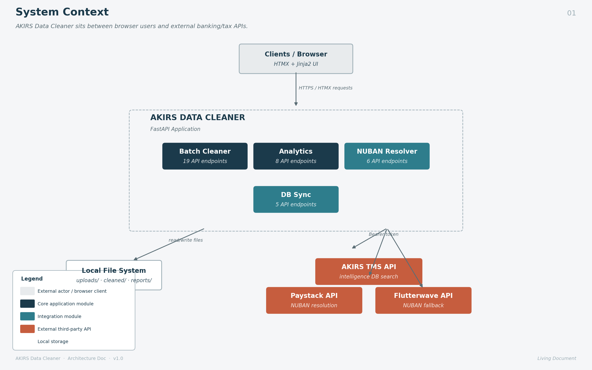
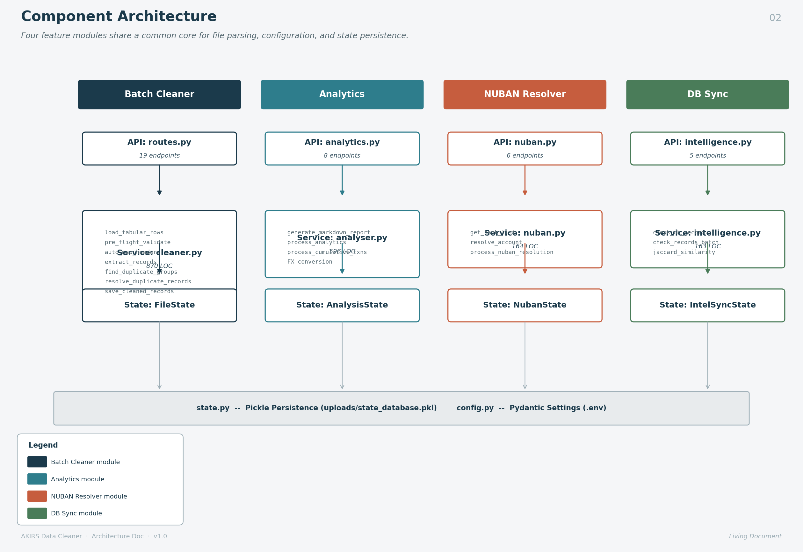
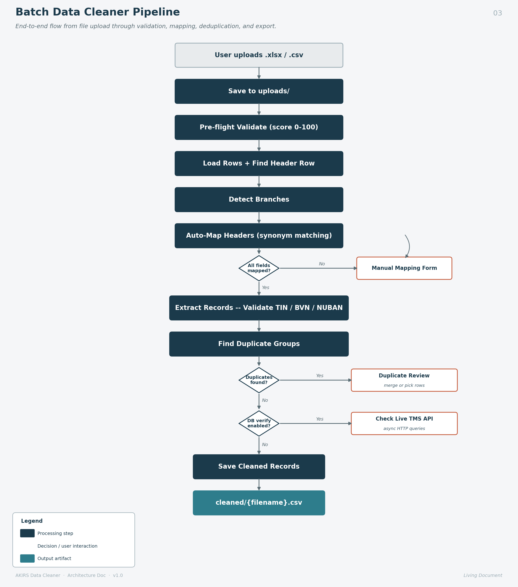
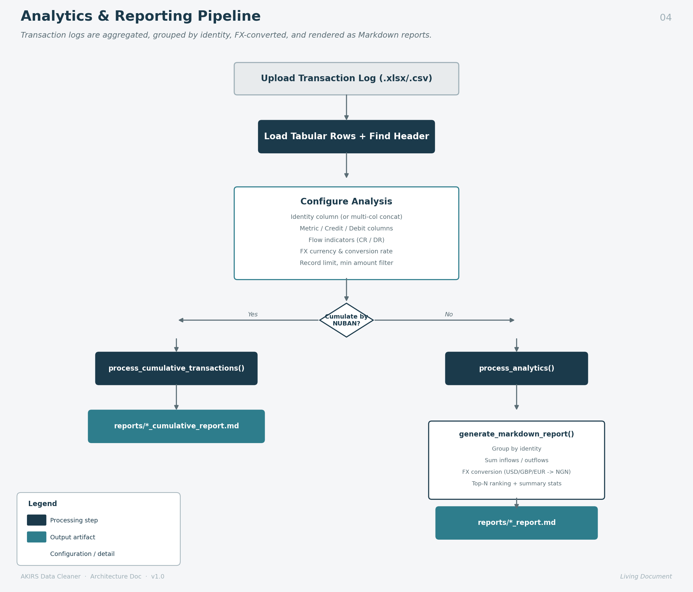
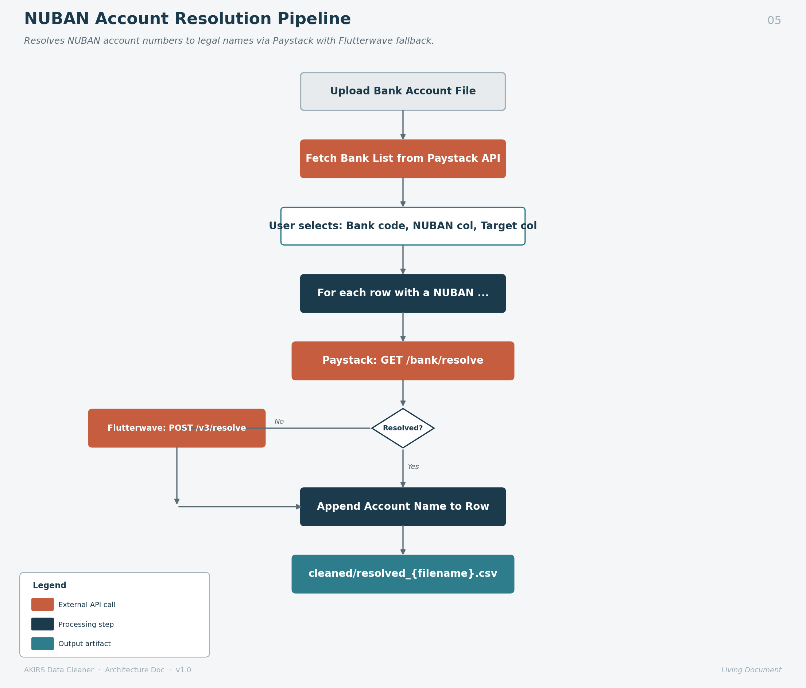
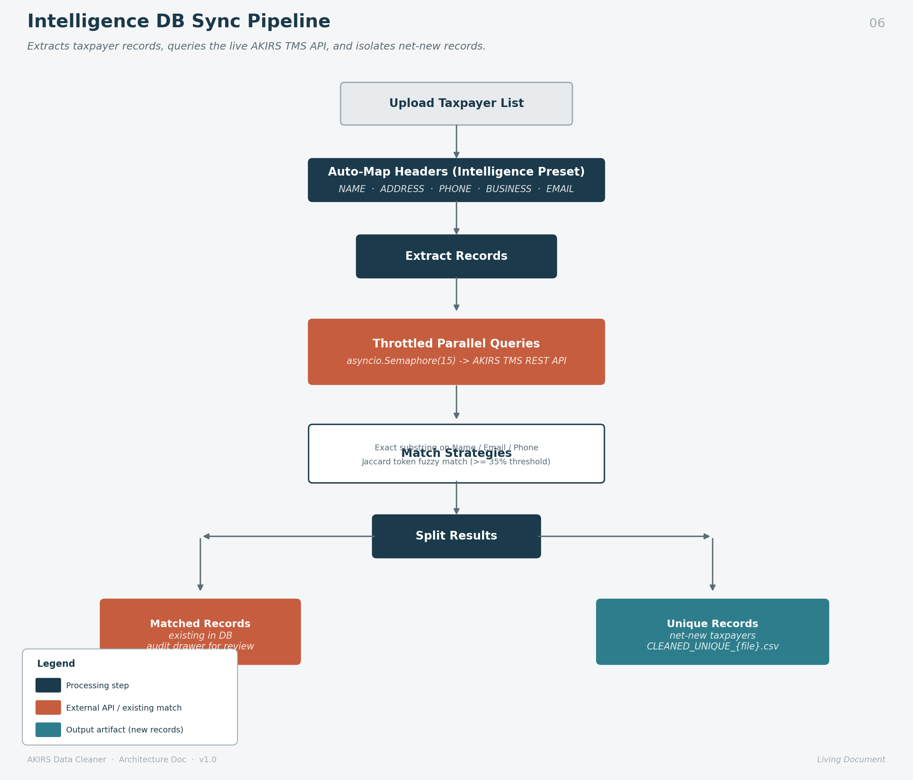
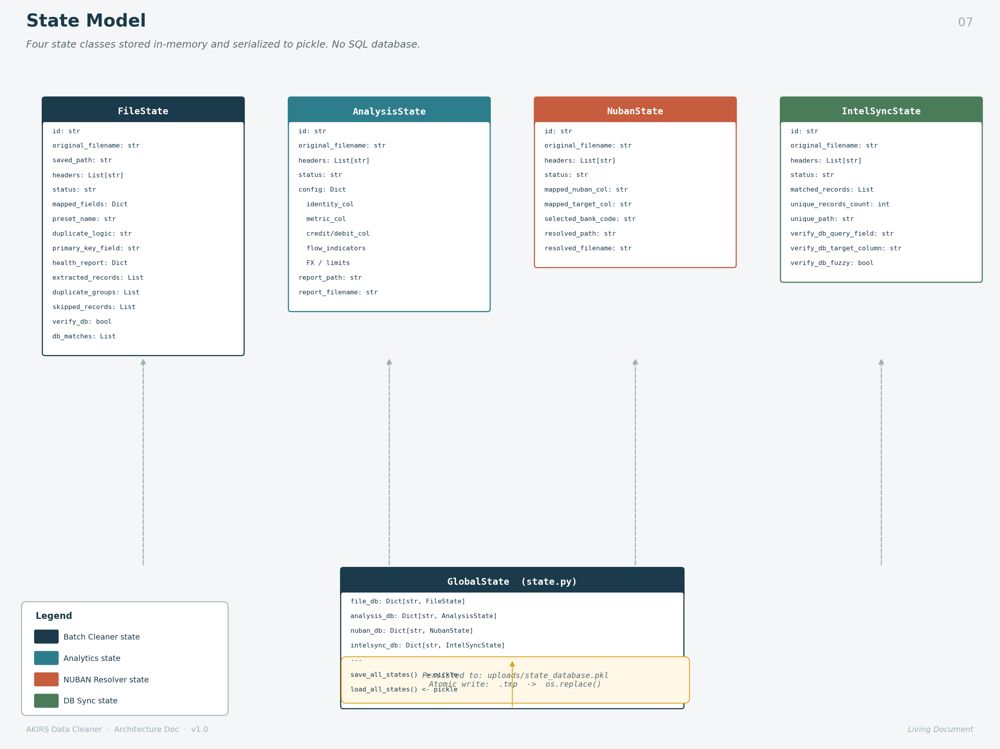

# AKIRS Data Cleaner — System Design & Architecture

## 1. System Overview

The **AKIRS (Akwa Ibom State Internal Revenue Service) Data Cleaner** is a web-based data ingestion, cleansing, deduplication, and analytics platform built for tax administration workflows. It processes messy bank extracts, retail tax filings, and taxpayer intelligence records into clean, standardized datasets.

**Tech Stack:** FastAPI · Jinja2 · HTMX · openpyxl · httpx · Pydantic Settings

---

## 2. System Context



The system follows a **three-tier architecture**:
- **Client Tier** — HTMX-powered browser UI with Jinja2 server-side templates, enabling dynamic partial page updates without a JavaScript framework.
- **Application Tier** — FastAPI backend split into 4 API routers and 4 service modules, with a shared core for configuration and state.
- **Storage/Integration Tier** — Local file system for uploads, cleaned outputs, and reports; plus 3 external REST APIs (Paystack, Flutterwave, AKIRS TMS).

> **Note:** There is **no SQL database**. All application state is held in-memory via Python dictionaries and persisted to disk using `pickle` at `uploads/state_database.pkl` with atomic file replacement.

---

## 3. Component Architecture



The application is organized into **4 independent feature modules**, each with its own API router, service layer, and state model:

| Module | API Endpoints | Service LOC | State Class | Output |
|---|---|---|---|---|
| **Batch Cleaner** | 19 | 870 | `FileState` | `cleaned/*.csv` |
| **Analytics & Reports** | 8 | 596 | `AnalysisState` | `reports/*_report.md` |
| **NUBAN Resolver** | 6 | 164 | `NubanState` | `cleaned/resolved_*.csv` |
| **DB Sync** | 5 | 163 | `IntelSyncState` | `cleaned/CLEANED_UNIQUE_*.csv` |

All modules share the core `cleaner.py` service for file loading and header detection, and are unified by `state.py` for persistence and `config.py` for environment settings.

---

## 4. Data Flow Diagrams

### 4.1 Batch Data Cleaner Pipeline



The batch cleaner is the core module. The pipeline steps:

1. **Upload** — Files saved to `uploads/`, deduplicated by SHA-256 hash
2. **Pre-flight Validate** — Structural health score (0–100) detecting merged cells, formula errors, empty headers, jagged rows
3. **Header Detection** — Heuristic scan of first 20 rows to find the true header row (≥3 non-empty string cells)
4. **Branch Detection** — Identifies branch/location columns by keyword scoring
5. **Auto-Map** — Matches file headers to target fields via synonym dictionaries
6. **Extract & Validate** — TIN (alphanumeric ≥5 chars), BVN (exactly 11 digits), NUBAN (exactly 10 digits)
7. **Deduplication** — Primary key grouping OR Sorted Neighborhood Method (3-gram Jaccard ≥0.82 + Union-Find)
8. **DB Verification** — Optional async check against live AKIRS TMS API
9. **Export** — Writes clean CSV to `cleaned/`

### 4.2 Analytics & Reporting Pipeline



### 4.3 NUBAN Account Resolution Pipeline



### 4.4 Intelligence DB Sync Pipeline



---

## 5. State Model



The application uses **4 state classes**, each stored in an in-memory `Dict[str, State]`:

| State Class | Managed By | Key Fields |
|---|---|---|
| **FileState** | `file_db` | headers, mapped_fields, preset_name, duplicate_logic, health_report, extracted_records, duplicate_groups, db_matches |
| **AnalysisState** | `analysis_db` | config dict (identity/metric/credit/debit cols, FX, limits), report_path |
| **NubanState** | `nuban_db` | mapped_nuban_col, mapped_target_col, selected_bank_code, resolved_path |
| **IntelSyncState** | `intelsync_db` | matched_records, unique_records_count, verify_db_fuzzy |

All 4 dictionaries are serialized together to `uploads/state_database.pkl` via `save_all_states()` (atomic write: `.tmp` → `os.replace`), and loaded on startup via `load_all_states()`.

---

## 6. External API Integrations

| Integration | Purpose | Auth | Endpoint |
|---|---|---|---|
| **Paystack** | Bank list + NUBAN → Account Name | `Bearer PAYSTACK_SECRET_KEY` | `api.paystack.co/bank`, `/bank/resolve` |
| **Flutterwave** | Fallback NUBAN resolution | `Bearer FLUTTERWAVE_SECRET_KEY` | `api.flutterwave.com/v3/accounts/resolve` |
| **AKIRS TMS** | Live intelligence DB search | `Bearer INTELLIGENCE_TOKEN` | `akirs-tms.net/.../intelligenceGathering` |

---

## 7. UI Template Hierarchy

The frontend uses **HTMX** for dynamic partial updates. The main `index.html` shell has a nav bar with 5 tabs, each loading a different view via HTMX into `#main-content`:

| Tab | View Partial | Card Partials | Config/Action Partials |
|---|---|---|---|
| **Batch Process** | `process_view.html` | `file_cards.html` → `file_card.html` | `mapping_form.html`, `duplicate_review.html`, `db_review.html`, `health_report.html`, `skip_report.html`, `data_view.html` |
| **Cleaned Datasets** | `cleaned_view.html` | — | — |
| **Analyse & Report** | `analyse_view.html` | `analyse_file_cards.html` → `analyse_file_card.html` | `analyse_config_form.html` |
| **NUBAN Audit** | `nuban_view.html` | `nuban_file_cards.html` → `nuban_file_card.html` | `nuban_config_form.html` |
| **DB Sync** | `intelligence_view.html` | `intelligence_file_cards.html` → `intelligence_file_card.html` | `intelligence_config_form.html` |

---

## 8. File System Layout

```
akirs/
├── main.py                          # FastAPI app + router mounts
├── app/
│   ├── api/
│   │   ├── routes.py                # Batch cleaner (19 endpoints)
│   │   ├── analytics.py             # Analytics & reports (8 endpoints)
│   │   ├── nuban.py                 # NUBAN resolver (6 endpoints)
│   │   └── intelligence.py          # DB sync (5 endpoints)
│   ├── services/
│   │   ├── cleaner.py               # Core data pipeline (870 LOC)
│   │   ├── analyser.py              # Financial analytics (596 LOC)
│   │   ├── nuban.py                 # Banking API integration (164 LOC)
│   │   └── intelligence.py          # TMS API integration (163 LOC)
│   └── core/
│       ├── config.py                # Pydantic Settings (.env loader)
│       └── state.py                 # State models + pickle persistence
├── templates/
│   ├── index.html                   # App shell
│   └── partials/                    # 22 HTMX partial templates
├── static/
│   ├── css/style.css
│   ├── js/app.js
│   └── akirs.png
├── uploads/                         # Raw uploads + state_database.pkl
├── cleaned/                         # Output CSVs
├── reports/                         # Markdown analysis reports
└── docs/
    ├── architecture.md              # This document
    └── generate_diagrams.py         # Script to regenerate diagrams
```

---

## 9. Key Algorithms

### Deduplication Strategies

| Strategy | Preset | Algorithm | Complexity |
|---|---|---|---|
| **Primary Key** | Retail (NUBAN) | Group by exact key, merge best non-empty fields | O(N) |
| **Fuzzy SNM** | Intelligence | Sort records → sliding window (W=15) → 3-gram char set Jaccard (≥0.82) → Union-Find transitive closure | O(N log N + N·W) |

### Data Validation

| Field | Rule |
|---|---|
| TIN (Taxpayer ID) | Alphanumeric, ≥ 5 characters |
| BVN | Exactly 11 digits |
| NUBAN | Exactly 10 digits |

---

## 10. Environment Configuration

| Variable | Required For | Description |
|---|---|---|
| `PAYSTACK_SECRET_KEY` | NUBAN Resolver | Paystack API secret key |
| `FLUTTERWAVE_SECRET_KEY` | NUBAN fallback | Flutterwave API secret key |
| `INTELLIGENCE_TOKEN` | DB Sync | JWT Bearer token for AKIRS TMS |

All loaded from `.env` via Pydantic Settings with `extra="ignore"`.
