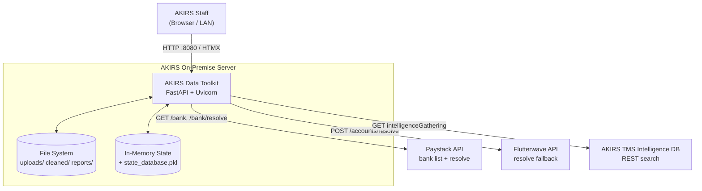
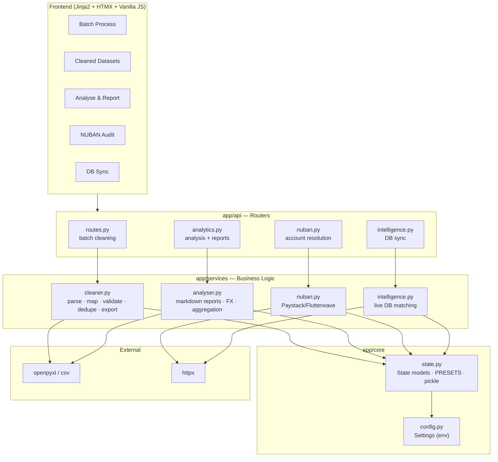
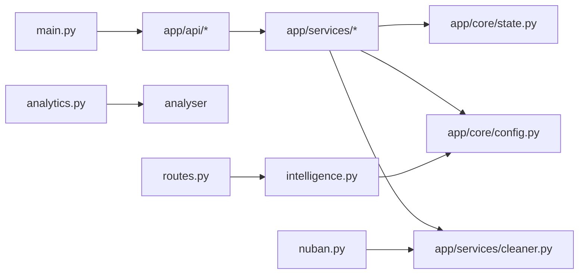
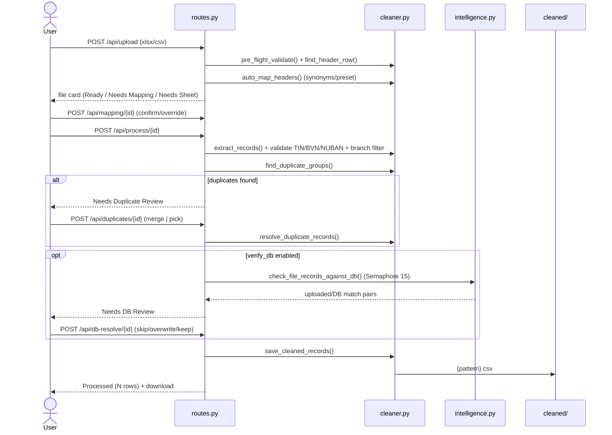
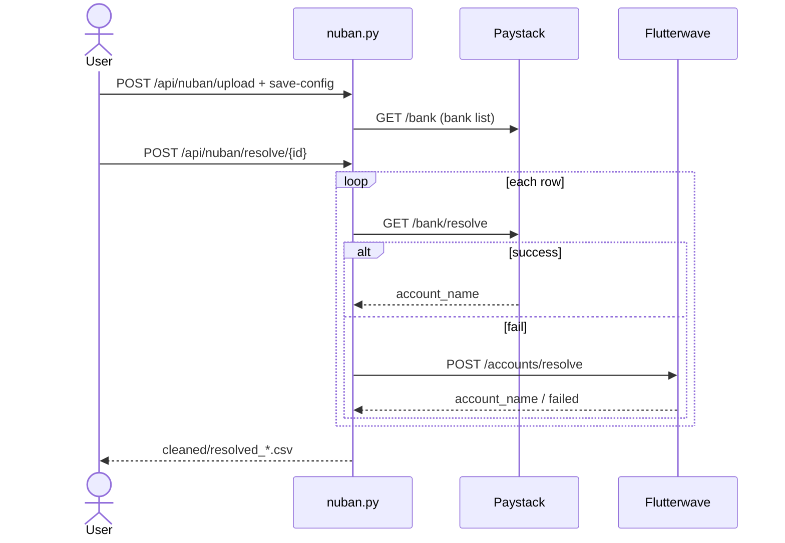
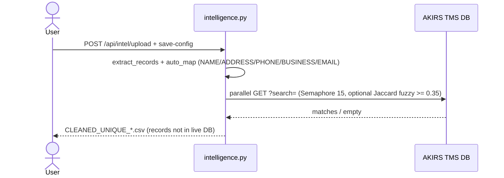
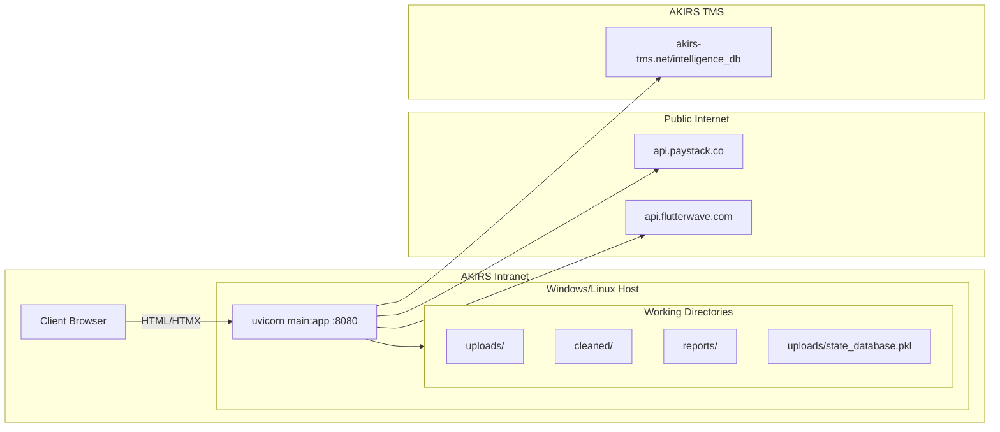

# System Design — AKIRS Data Toolkit

> Derived from the current codebase (`main.py`, `app/`, `templates/`, `static/`).

## 1. High-Level Context



## 2. Component / Layer Architecture



## 3. Module Dependency Graph



`cleaner.py` is the shared kernel — `routes.py`, `analytics.py`, `nuban.py`, and `intelligence.py` all depend on it for `load_tabular_rows` / header detection / CSV writing.

## 4. Batch Cleaning Pipeline (sequence)



## 5. NUBAN Resolution Pipeline



## 6. Intelligence DB Sync Pipeline



## 7. State Model

```mermaid
classDiagram
    class FileState {
        +id, original_filename, saved_path
        +headers, status, sheet_names, selected_sheets
        +available_branches, selected_branches
        +extracted_records, duplicate_groups, skipped_records
        +mapped_fields, field_separators, preset_name
        +duplicate_logic, primary_key_field, output_pattern
        +health_report, verify_db
        +db_matches, db_decisions
    }
    class AnalysisState {
        +config: identity/metric/currency/flow/limit
        +report_path, report_filename
    }
    class NubanState {
        +mapped_nuban_col, mapped_target_col
        +selected_bank_code, resolved_path
    }
    class IntelSyncState {
        +matched_records, unique_records_count
        +verify_db_query_field, verify_db_target_column, verify_db_fuzzy
    }
    FileState --> "file_db"
    AnalysisState --> "analysis_db"
    NubanState --> "nuban_db"
    IntelSyncState --> "intelsync_db"
```

All four dicts are persisted together via `pickle` to `uploads/state_database.pkl` on every mutation (`save_all_states()`), and loaded at startup (`load_all_states()`).

## 8. Deployment Topology



## 9. API Surface

| Router | Endpoints |
|--------|-----------|
| `routes.py` | `/`, `/api/upload`, `/api/components/mapping/{id}`, `/api/mapping/{id}`, `/api/process/{id}`, `/api/duplicates/{id}`, `/api/db-resolve/{id}`, `/api/view/*`, `/api/download/{f}`, `/api/download-batch` |
| `analytics.py` | `/api/analyse/view`, `/upload`, `/config/{id}`, `/components/config-form/{id}`, `/generate/{id}`, `/delete/{id}`, `/download/{f}`, `/view-report/{f}` |
| `nuban.py` | `/api/nuban/view`, `/upload`, `/config-form/{id}`, `/save-config/{id}`, `/resolve/{id}`, `/delete/{id}` |
| `intelligence.py` | `/api/intel/view`, `/upload`, `/config-form/{id}`, `/save-config/{id}`, `/delete/{id}` |

## 10. Key Decision Points

| Stage | User Action | Outcome |
|-------|-------------|---------|
| Duplicates found | Merge / Pick records | Remaining records proceed to DB check |
| DB verification enabled | Skip / Overwrite / Keep | Skipped excluded; Overwrite replaces DB; Keep retains upload |
| No duplicates + no DB matches | Automatic | Records written directly to CSV |
| Multi-sheet workbook | Select sheet(s) | Headers/branches re-detected for the chosen sheet |
